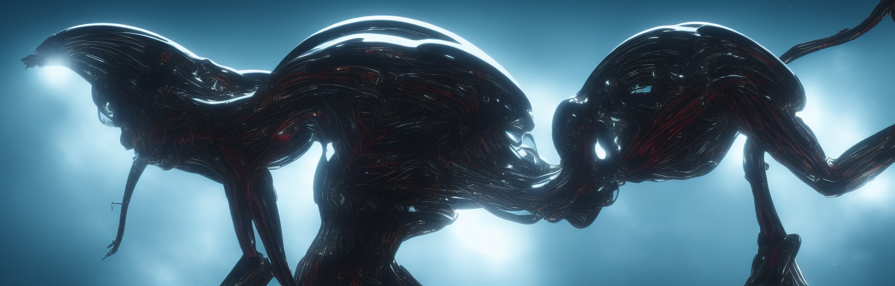
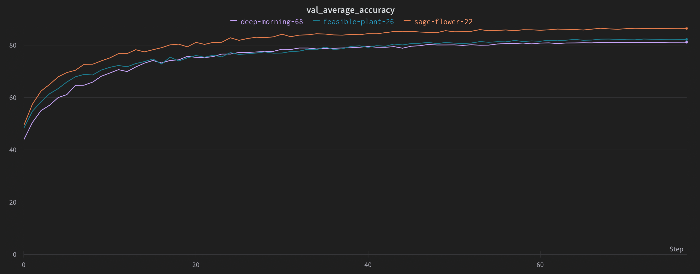

# vit
A PyTorch implementation of [An Image is Worth 16x16 Words: Transformers for Image Recognition at Scale](https://arxiv.org/abs/2010.11929)



 
### Installation
```
git clone https://github.com/andregaio/vit.git
cd vit
conda create -n vit python=3.8
conda activate vit
pip install -r requirements.txt
```
### Models
| Name        |   Accuracy  |   Params[M]  |   FLOPS [G]  |
| :---------- |   :------:  |   :------:   |   :------:   |
| ViTBase     |   84.266    |    77.988    |     5.07     |
| ViTLarge    |             |    277.11    |     18.015   |
| ViTHuge     |       a|   ________   |   _________  |

### Dataset
- [CIFAR10](https://pytorch.org/vision/stable/generated/torchvision.datasets.CIFAR10.html)

### Training
```
python train.py --model vit_base
```

### Eval
```
python eval.py --model vit_base --weights weights/checkpoint_00070.pt
```

### Inference
```
python infer.py --model vit_base --weights weights/checkpoint_00070.pt --image assets/cat.png
```

### [Results](https://wandb.ai/andregaio/vgg)
<div align="center">





</div>

### Notes
 - This implementation is not designed to be a complete replica of the original
 - **Accuracy** has been used to evaluate classification performance
 - Has been trained on **CIFAR10**
 - Input resolution has been changed to **32x32** to match dataset
 - **Automatic Mixed Precision (AMP)** training with gradient scaling and autocasting
 - Model architecture code has been borrowed from https://github.com/huggingface/pytorch-image-models